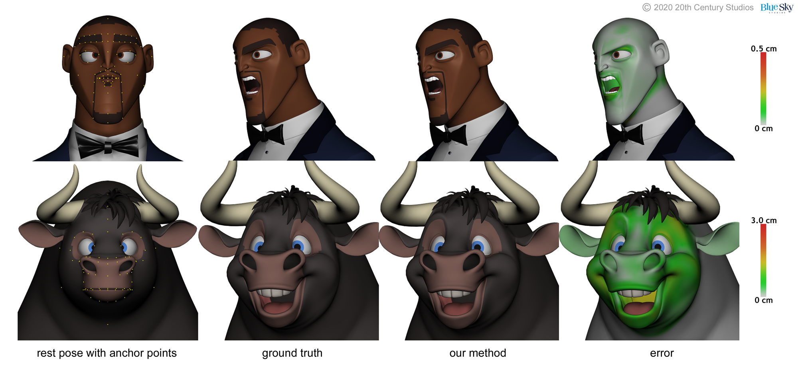

This is the source repo for the SIGGRAPH2020 paper:

**Accurate Face Rig Approximation With Deep Differential Subspace Reconstruction** (https://doi.org/10.1145/3386569.3392491)

Preprint available [here](https://arxiv.org/abs/2006.01746)

<p float="center">

</p>

## Abstract

To be suitable for film-quality animation, rigs for character deformation must fulfill a broad set of requirements. They must be able to create highly stylized deformation, allow a wide variety of controls to permit artistic freedom, and accurately reflect the design intent. Facial deformation is especially challenging due to its nonlinearity with respect to the animation controls and its additional precision requirements, which often leads to highly complex face rigs that are not generalizable to other characters. This lack of generality creates a need for approximation methods that encode the deformation in simpler structures. We propose a rig approximation method that addresses these issues by learning localized shape information in differential coordinates and, separately, a subspace for mesh reconstruction. The use of differential coordinates produces a smooth distribution of errors in the resulting deformed surface, while the learned subspace provides constraints that reduce the low frequency error in the reconstruction. Our method can reconstruct both face and body deformations with high fidelity and does not require a set of well-posed animation examples, as we demonstrate with a variety of production characters.

## Bibtex

Please cite our paper if you use this code for your research: 
```
@article{Song2020Face,
author = {Song, Steven L. and Shi, Weiqi and Reed, Michael},
title = {Accurate Face Rig Approximation with Deep Differential Subspace Reconstruction},
year = {2020},
volume = {39},
number = {4},
journal = {ACM Trans. Graph.},
numpages = {12}
}
```

## Usage

 Coming soon ...
