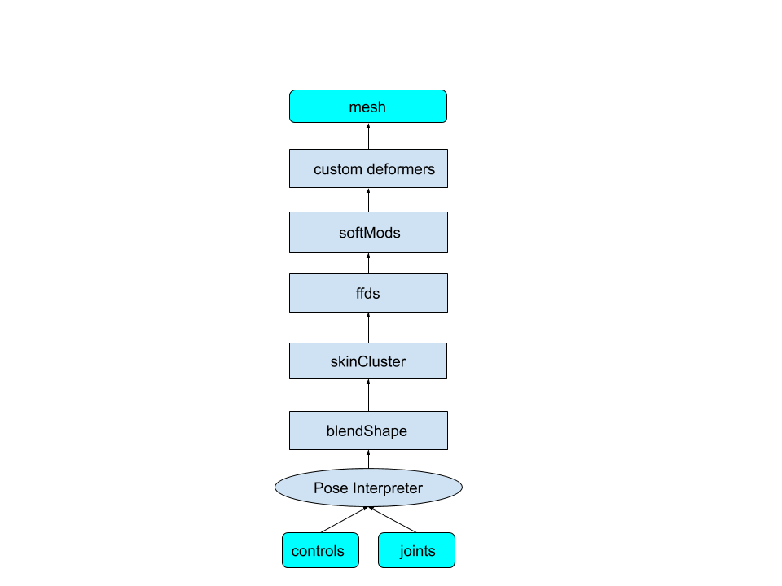
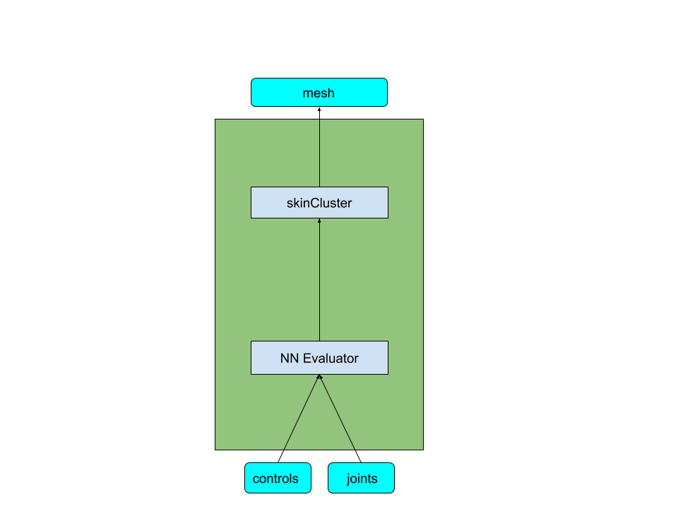
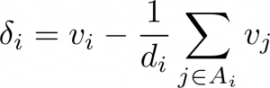
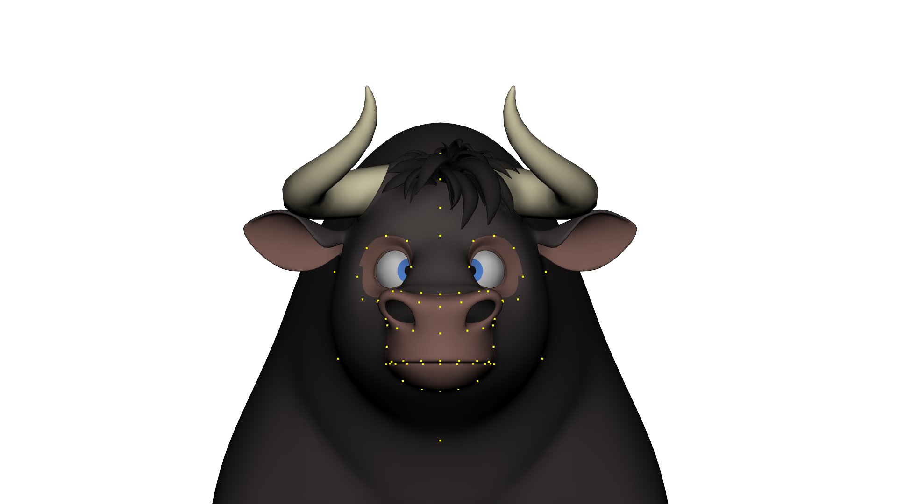

## Description

### This is the open source repo for the SIGGRAPH2020 paper:
**Accurate Face Rig Approximation With Deep Differential Subspace Reconstruction**

###### Preprint available [here](https://arxiv.org/abs/2006.01746). (https://doi.org/10.1145/3386569.3392491)

###### Authors: Steven L. Song\*, Weiqi Shi\*, Michael Reed (* equal contribution)


<p float="center">

</p>

## Abstract

To be suitable for film-quality animation, rigs for character deformation must fulfill a broad set of requirements. They must be able to create highly stylized deformation, allow a wide variety of controls to permit artistic freedom, and accurately reflect the design intent. Facial deformation is especially challenging due to its nonlinearity with respect to the animation controls and its additional precision requirements, which often leads to highly complex face rigs that are not generalizable to other characters. This lack of generality creates a need for approximation methods that encode the deformation in simpler structures. We propose a rig approximation method that addresses these issues by learning localized shape information in differential coordinates and, separately, a subspace for mesh reconstruction. The use of differential coordinates produces a smooth distribution of errors in the resulting deformed surface, while the learned subspace provides constraints that reduce the low frequency error in the reconstruction. Our method can reconstruct both face and body deformations with high fidelity and does not require a set of well-posed animation examples, as we demonstrate with a variety of production characters.

## Bibtex

Please cite our paper if you use this code for your research: 
```
@article{song2020accurate,
author = {Song, Steven L. and Shi, Weiqi and Reed, Michael},
title = {Accurate Face Rig Approximation with Deep Differential Subspace Reconstruction},
year = {2020},
volume = {39},
number = {4},
journal = {ACM Trans. Graph.},
numpages = {12}
}
```

## Setup and Use


This remainder of this document gives an overview of the setup and use of the project code, the details of which are expanded upon in the [paper](https://arxiv.org/abs/2006.01746). It assumes that you are using Maya -- although the code has been written to be as decoupled as possible -- and it also assumes you have the ability to examine your character's rig and build the necessary descriptor files. These files allow the system to properly sample into the space of controls; examples of these files are given, and looking through them - along with the code - goes a long way when understanding how it all fits together. If you are an engineer, you would be well-advised to pair up with a technical artist to help you with this.

The vast majority of the code is focused on accessing and saving the control space of the rig, determining the relationship between the joints, and the resulting mesh surface data. Comparatively little is for the feedforward network model (keras, on tensorflow, in the file mlp.py) and for the Maya plugin (bssNNDeform). The Maya plugin is the TensorFlow cpu version - if you want higher fps, you will have to compile with the GPU version of TensorFlow, or even better write your own GPU plugin (which is relatively simple due to the structure of the networks used). The points at which to insert this code are either clear by design, or called out with a comment in the code.

The concept is that we want to be able to take an arbitrary rig that has a complex deformation structure, as on the left, and convert it a structure like the one on the right:


|  |  |
:-------------------------:|:-------------------------:


The motivation behind it is that no matter what deformers are used in the rig, we can always generate a deformer stack that only has a skinCluster and a neural network evaluator. The resulting rig can be used as a universal porting solution between different applications. The neural network approximation also offers a solution for baking a simulation rig to a regular rig, and will likely behave a lot better compared to other baking approaches. 

The whole process can be divided into three steps:

1. generating training data;

2. training the neural network;

3. constructing the neural network evaluator and using it as a deformer


## Differential Coordinates:

Before we go into details, it's worth mentioning a technique we used for this project: differential coordinates, which have properties that are particularly useful in this work. We do not directly conduct training on local offsets, instead it's converted to differential coordinates.

Differential coordinates are fairly easy to calculate:

<p float="center">

</p>


where vi is the position of vertex i, di is the number of neighbors for vertex i, Ai is the set of vertices that are neighbors of vi. 

Basically, for a vertex, differential coordinate is the difference between its position and its neighbors' averaging position. 

As of why differential coordinates are used instead of Cartesian coordinates, it's a rather lengthy topic and please refer to our paper for details.


## Generating Training Data

For training data, we need to be able to do the following steps:

1. being able to pose the rig randomly. The poses need to reasonably reflect the rig behavior.

2. being able to extract the deformation as a local offset before the skinCluster is applied. We include code for this in neuralRig.prep.correctiveBlendshape

3. being able to record the rig inputs. For numeric controls, this is easy: just record the value of the control, e.g. CornerMover.angle. For joints, its desirable to have clean/isolated inputs, so we don't want to use worldMatrix of a joint (which contains ancestors' transformation information). Instead we need to get the local matrix for joints, which requires knowing the parenting relationship for joints/transforms. 

4. being able to convert local offset to differential coordinates, and converting it back. Converting local offset to differential coordinates is trivial, and we can use the equation above. Converting it back to local offset value is impossible without additional data. The reason for this is that there are infinite sets of Cartesian coordinates that will produce exactly the same set of differential coordinates. For example, if we shift the whole mesh by 5 units along x axis, the calculated differential coordinates are still the same. 

We call the additional data required "anchor points", which are pre-selected points on the mesh for which we also record their Cartesian local offset values. These anchor points help "anchor down" the mesh when reconstructing local offset value from differential coordinates. 

For more details, please refer to our paper, or Sorkine's excellent paper on Laplacian mesh processing: https://diglib.eg.org/handle/10.2312/egst.20051044.053-070


With the 4 requirements above, there are several files we need to prepare. 

1. A file that defines the range for rig controls. An example is in the repo file:

>           mlrig/python/neuralRig/examples/character_1/face_control_limit_extended.csv

The file is generated by first running a method that goes through a library of standard poses for your character:

```
import neuralRig.prep.dataPrep as dp
mr = dp.MoverRanges() #MoverRanges is a utility class that helps generating data related to mover ranges
mr.retrieve_from_pose_lib(POSE_LIB_PATH)
mr.export(EXPORT_PATH)
```

The csv file generated from the script above is not perfect, but a good starting point. The user can then manually inspecting the csv file to make sure the ranges are reasonable. 


2. A file that defines the parenting relationship between joints. Here is an example:

>          mlrig/python/neuralRig/examples/character_1/joint_relations.csv

The file is generated by running the following script:

```
import neuralRig.prep.dataPrep as dp
jr = dp.JointRelations() #JointRelations is a utility class that helps generating data related to joint parenting relationships
jr.retrieve_from_scene()
jr.export(EXPORT_PATH)
```

Again the generated csv file is not perfect, because it relies on the .recordParent attribute in the rig to figure out the joint parent. Some of the joints have either missing or incorrect .recordParent attribute. So the csv file needs to be manually inspected as well. 


3. A file that specifies the anchor points. Here is an example:

>          mlrig/python/neuralRig/examples/character_1/face_anchors_2_percent.csv

Here is an example of vertices that are selected as anchor points on a character:

<p float="center">

</p>

The anchor points are selected so that they reasonably covers the mesh, and has higher density for regions that are heavily deformed. We found that roughly selecting 2% vertices as anchor points give us pretty good result. However, dropping to 1% still gives pretty decent result. 

For more detailed analysis on anchor points, please refer to the paper.

Here is the snippet for generating the csv file for anchor points: (The vertices need to be selected first)
```
import neuralRig.prep.dataPrep as dp
ap = dp.AnchorPoints() # AnchorPoints is a utility class that helps generating data related to anchor points
ap.retrieve_from_scene()
ap.export(EXPORT_PATH)
```

4. We can also create an optional file that specifies what should be included for training. This allows you, for example, to use the csv file to specify that only vertices on the face are to be included in the training. Here is an example:

>          mlrig/python/neuralRig/examples/character_1/face_inclusion.csv

Here is the snippet for generating it:

```
import neuralRig.prep.dataPrep as dp
di = dp.DataInclusion() #DataInclusion is a utility class that helps manage what to be included for training. 
#select vertices to be included
di.add_selected()
#select more objects to be included
di.add_selected()
di.export(EXPORT_PATH)
```


5. The last file we need is a file that maps vertex id to all controls that affect that vertex. We need this file for training the anchor network. Here is an example:

>           mlrig/python/ml/neuralRig/examples/character_1/face_control_mapping.json


You will have to provide this script: it can be done relatively quickly in the maya script editor. The idea is to first put the rig in a random pose, and then perturb each rig control, and see which vertex has its position changed, then repeat this process several times for different random poses to make sure we get a good coverage. 


6. With all the files above, we can proceed to generate training data. However, it's a lot of files to manage and difficult to track what files are used to generate training data. 

For tracking purposes, when training is being done it makes an additional .ini file called config.ini with all the settings and file paths used in the training.  This is very useful to restart or recreate a training session. Here is an example:

>          mlrig/python/neuralRig/examples/character_1/data_gen_test.ini


With all the files above, we can finally start generating training data.  Here is an example, it assumes you have implemented RigPoseGenerator.batch_export_farm() for your environment. If you have not, you can replace the call to that with RigPoseGenerator.batch_export(), which will do the same thing, only on a single machine. You only generate this data once so it is not prohibitive.


Open your maya file, for example: facePrep.mb


Run the following snippet:
```
import neuralRig.prep.rigPoseGen as rpg
generator = rpg.RigPoseGenerator.from_config('/path_to_ini_config_file/data_gen_test.ini')
generator.batch_export_farm('/path_to_where_you_wish_to_store_training_data/demo',  #export path
							10, #number of poses
							batch_size=5) #how many poses to store in a single file
```              

The above command should generate a set of files, much like these which are from our own example:

```
-rw-rw-rw- 1 a_user  16680 Jun  4 02:01 anchorPoints0.pkl
-rw-rw-rw- 1 a_user  16680 Jun  4 02:01 anchorPoints1.pkl
-rw-rw-rw- 1 a_user  10632 Jun  4 02:01 controls0.pkl
-rw-rw-rw- 1 a_user  10632 Jun  4 02:01 controls1.pkl
-rw-rw-rw- 1 a_user    572 Jun  4 02:01 data_gen_test.ini
-rw-rw-rw- 1 a_user 841466 Jun  4 02:01 differentialOffset0.pkl
-rw-rw-rw- 1 a_user 841466 Jun  4 02:01 differentialOffset1.pkl
drwxrwsrwx 5 a_user    106 Jun  4 01:58 exportLog
-rw-rw-rw- 1 a_user  11372 Jun  4 02:01 jointLocalMatrix0.pkl
-rw-rw-rw- 1 a_user  11372 Jun  4 02:01 jointLocalMatrix1.pkl
-rw-rw-rw- 1 a_user   7322 Jun  4 02:01 jointLocalQuaternion0.pkl
-rw-rw-rw- 1 a_user   7322 Jun  4 02:01 jointLocalQuaternion1.pkl
-rw-rw-rw- 1 a_user  11372 Jun  4 02:01 jointWorldMatrix0.pkl
-rw-rw-rw- 1 a_user  11372 Jun  4 02:01 jointWorldMatrix1.pkl
-rw-rw-rw- 1 a_user   7322 Jun  4 02:01 jointWorldQuaternion0.pkl
-rw-rw-rw- 1 a_user   7322 Jun  4 02:01 jointWorldQuaternion1.pkl
-rw-rw-rw- 1 a_user 841466 Jun  4 02:01 localOffset0.pkl
-rw-rw-rw- 1 a_user 841466 Jun  4 02:01 localOffset1.pkl
-rw-rw-rw- 1 a_user   6006 Jun  4 02:01 moverValues0.pkl
-rw-rw-rw- 1 a_user   6006 Jun  4 02:01 moverValues1.pkl
-rw-rw-rw- 1 a_user 841466 Jun  4 02:01 worldOffset0.pkl
-rw-rw-rw- 1 a_user 841466 Jun  4 02:01 worldOffset1.pkl
-rw-rw-rw- 1 a_user 841466 Jun  4 02:01 worldPos0.pkl
-rw-rw-rw- 1 a_user 841466 Jun  4 02:01 worldPos1.pkl
```

In the api call, we specified 10 poses to generate, and the batch_size is 5. So for each type of data, 2 files are generated. The data_gen_test.ini is also copied to the data folder, so that later we can track how the data is generated, and some diagnostic data from training is appended to it as well. In this way, you will always know how a dataset was constructed and can restart the process identically at a later date. 

For real training, the number of poses should be at least 10000, and a recommended batch size is 200. (On a "typical machine",  takes roughly 10~15 minutes to generate the training data with batch size 200. And for 10000 poses, you would set up batch_export_farm() so that e.g. 50 machines from the farm will be utilized) 

## Training

Once we have training data generated, we can start training. 

There are 2 networks that need to be trained: one is single feedforward network for the differential coordinate, and another which is a concatenated set of mini networks for the anchor points. For the details of the network structure, please refer to the paper: https://arxiv.org/abs/2006.01746.


It's a lot of settings to manage, so we use the same technique by using a .ini file to control the parameters. Here is an example:

>.     mlrig/python/neuralRig/examples/character_1/training_test.ini


Here is the snippet for launching training for the differential network: (This needs to run in a python prompt in a shell)

```
import ml.neuralRig.train.setup as setup
ts = setup.TrainingSession('/mlrig/python/neuralRig/examples/character_1/training_test.ini')
ts.train('differential')
```

And here is the snippet for launching training for the anchor network:

```
import ml.neuralRig.train.setup as setup
ts = setup.TrainingSession('/mlrig/python/neuralRig/examples/character_1/training_test.ini')
ts.train('anchor')
```

Again, the config file will be copied to a result folder (which is specified in the .ini file as the output_path parameter variable) so that we can track the settings used for training. The network metadata is stored in "differential" and "anchor" subdirectories respectively, in that output directory. In this example, we assume the training_test.ini file, as used above, has the line "output_path = /datadir/trainingResult/my_training_new".

```
ll /datadir/trainingResult/my_training_new
drwxrwsrwx 2 stevens  159 Jun  4 02:26 anchor
-rw-rw-rw- 1 stevens 2630 Jun  4 02:26 config.ini
drwxrwsrwx 2 stevens  183 Jun  4 02:24 differential
```

If you've set up you environment so that the mlrig folder is in your path, the training can also be launched by using a shell command (see the scripts in mlrig/bin):

```
neuralRigTrainDifferential /mlrig/python/neuralRig/examples/character_1/training_test.ini
neuralRigTrainAnchor /mlrig/python/neuralRig/examples/character_1/training_test.ini
```

The training_test.ini file provided here only runs a few iterations - you can see the number of epochs and the batch size specified in the differential_epoch, differential_batch_size, and anchor_epoch, anchor_batch_size parameter variables in that file. Real training runs a lot more iterations(over 10000) and takes much longer to finish - up to 24 hrs on a single high-performance machine without a good GPU. A good GPU can cut that by about 1/4 or more.


It's recommended to run differential training and anchor training on different machines, so that the 2 training can happen in parallel. 


## Evaluation
Once the training finishes, we can start doing some evaluation and verify the result. In the resulting config.ini file (which is stored in the output directory), the training data is divided into 2 sets. For example:

```
training_data_set = 0-48
evaluation_data_set = 49
```

This means files numbered from 0 to 48 will be used for training. Files numbered as 49 will be reserved for verification. The two sets should never overlap, as we want to do verification with new data, instead of data used to train the network. 

Here is the snippet of code to generate result for evaluation:
```
import ml.neuralRig.train.setup as setup
ts = setup.TrainingSession('/path_to_output_directory/config.ini')
ts.evaluate(['differential', 'anchor'])
```

Note that we use the config.ini file in the result folder instead of the original .ini file. That's because the config.ini file in the result folder contains additional network information generated from training, for example, where to find the metadata for the network. 

The step above generates json files which contain predicted results. To visualize, we need to load the result inside maya. 

The maya file needs to be prepped first, so that all deformers are removed except for skin cluster, otherwise you will see double transformation. 


Once we have a prepped maya file loaded. We can run the following snippet to visualize the evaluation result:
```
import ml.neuralRig.eval.rigPoseApply as rpa
applier = rpa.RigPoseApplier('/output_path_directory/config.ini')
applier.apply_pose(0, training_type='differential')     #the first argument is the pose number, starting at 0
```

There is also a function to go through all of the evaluated poses:
```
applier.go_through_all_poses(training_type='differential')
```
This method applies the evaluated poses one by one, and compares with the original rig(The original rig needs to be referenced in the maya file), and writes out the errors back to the ini file. 


## Live Evaluation

The evaluation above is only good for debugging purpose. So how do we use the network as a defomer on the rig? 

The first thing is to convert the network to an optimized format:
```
import ml.neuralRig.train.setup as setup
ts = setup.TrainingSession('/output_path_directory/config.ini')
ts.save_pb_file(['differential', 'anchor'])
```

After that, we can use the bssNNDeform plugin to load the network as a deformer. You will need to compile that code in a Maya development enviroment, along with access to the TensorFlow and Eigen libraries.


Load the plugin, and load the same maya file used for evaluation, and finally construct and attach a bssNNDeform node:


```
import ml.neuralRig.eval.rigPoseApply as rpa
applier = rpa.RigPoseApplier('/output_path_directory/config.ini')
applier.gen_deformer(training_type='differential')     #the first argument is the pose number, starting at 0
```

## Some comments on the choices of data files

There are multiple different file formats used for this project: csv, json, pkl, ini. The motivation behind it is that we want the best format for us to do the job quickly. A lot of the rig information files need to manually inspected, so we chose csv file. The ini file format is easy to read and very simple, so we chose it as the format to track all the settings. pkl is used for writing out training data because of its fast io speed. json naturally maps to a dictionary and is used when we need to write a dictionary out. 


